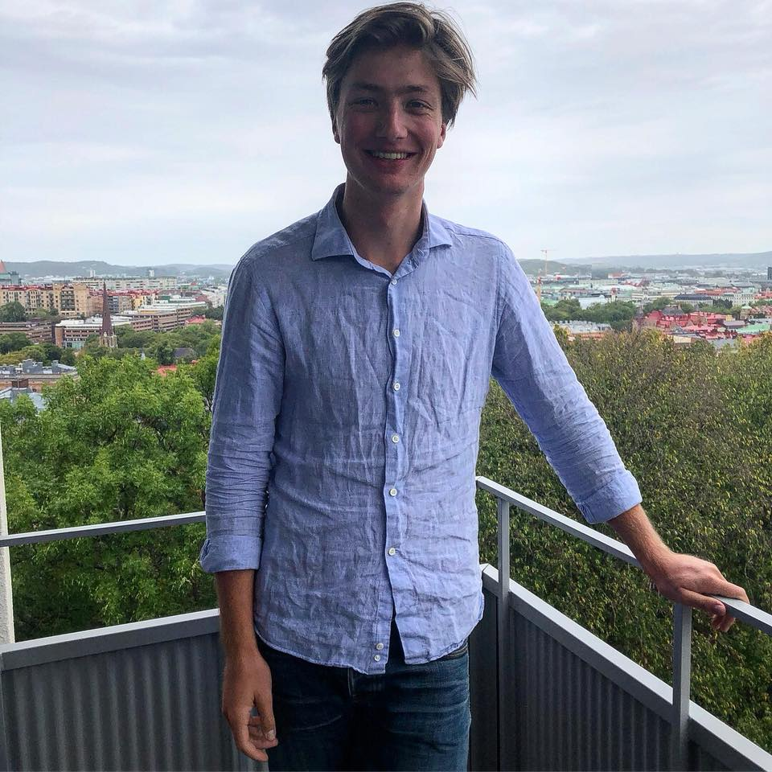

---
---

<link rel="stylesheet" href="styles.css" type="text/css">

I like to analyze data and learn new stuff, no matter the topic.

I am an alumni of Union College, KY, where I studied Mathematics and Business Administration while playing Golf. Currently I am currently purusing a Masters Degreen in Engineering Mathematics at Chalmers Univeristy of Technology in Gothenburg, Sweden. 

My current intrest is data analytics, programming and Probability Theory. I can write code in R, Matlab and C#.

My full CV is available [here](Files//Eriks_CV-6.pdf).